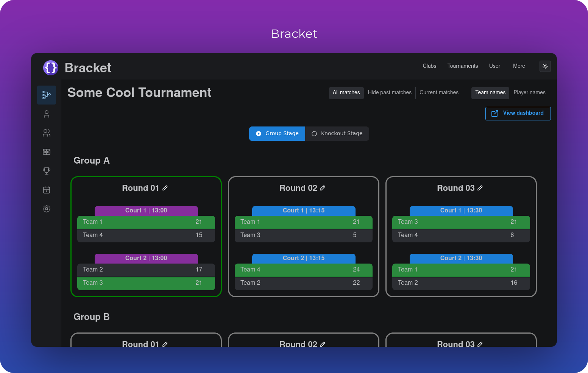
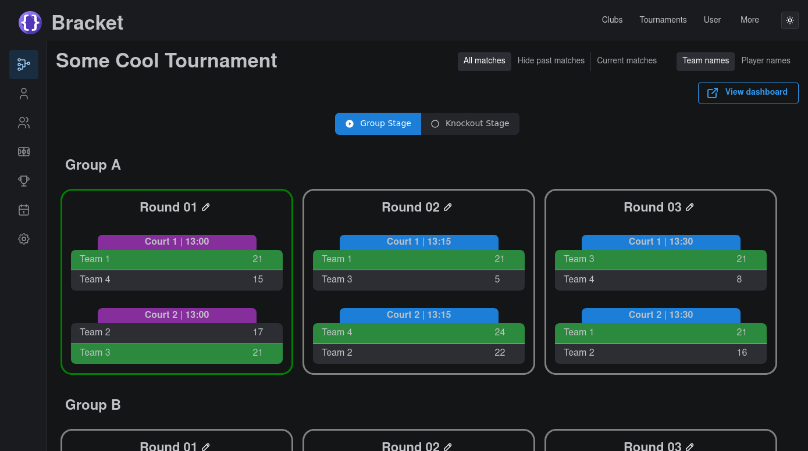
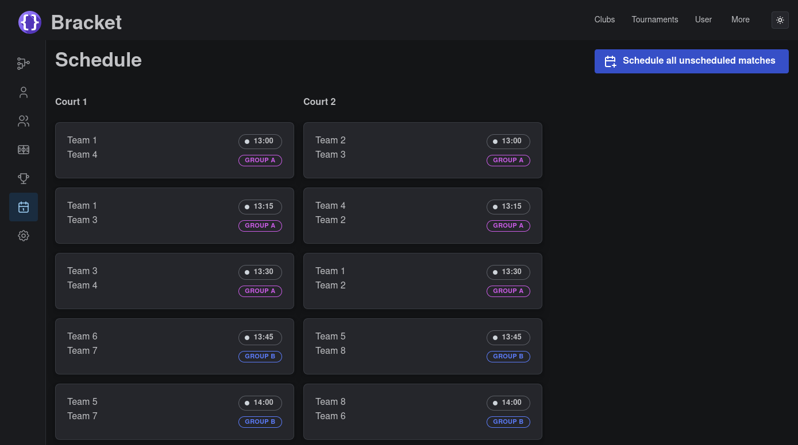
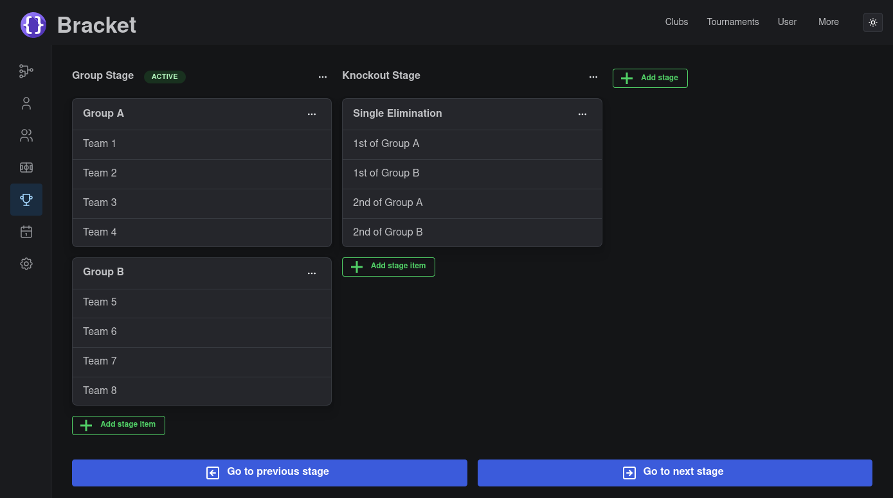
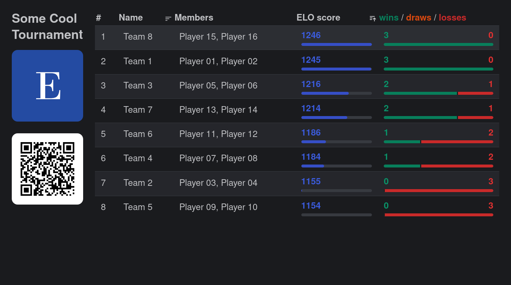

<p align="center">
  
</p>

<p align="center">
  <a href="https://github.com/evroon/bracket/actions"
    ></a>
  <a href="https://crowdin.com/project/bracket"
    ></a>
  <a href="https://github.com/evroon/bracket/commits/"
    ></a>
  <a href="https://github.com/evroon/bracket/releases"
    ></a>
  <a href="https://codecov.io/gh/evroon/bracket"
    ></a>
</p>
<p align="center">
  <a href="https://www.bracketapp.nl/demo">Demo</a>
  ·
  <a href="https://docs.bracketapp.nl">Documentation</a>
  ·
  <a href="https://docs.bracketapp.nl/docs/running-bracket/quickstart">Quickstart</a>
  ·
  <a href="https://github.com/evroon/bracket">GitHub</a>
  ·
  <a href="https://github.com/evroon/bracket/releases">Releases</a>
</p>
<p align="center">
<a href="https://trendshift.io/repositories/13714" target="_blank"></a>
</p>
<h1></h1>

Tournament system meant to be easy to use. Casa Familia Padel Club is written in async Python (with
[FastAPI](https://fastapi.tiangolo.com)) and [Vite](https://vite.dev/) as frontend using the
[Mantine](https://mantine.dev/) library.

It has the following features:
- Supports **single elimination, round-robin and swiss** formats.
- **Build your tournament structure** with multiple stages that can have multiple groups/brackets in
  them.
- **Drag-and-drop matches** to different courts or reschedule them to another start time.
- Various **dashboard pages** are available that can be presented to the public, customized with a
  logo.
- Create/update **teams**, and add players to **teams**.
- Create **multiple clubs**, with **multiple tournaments** per club.
- **Swiss tournaments** can be handled dynamically, with automatic scheduling of matches.



<p align="center">
<a href="https://docs.bracketapp.nl"><strong>Explore the Casa Familia Padel Club docs&nbsp;&nbsp;▶</strong></a>
</p>

# Live Demo
A demo is available for free at <https://www.bracketapp.nl/demo>. The demo lasts for 30 minutes, after which
your data will de deleted. 

# Quickstart
To quickly run bracket to see how it works, clone it and run `docker compose up`:
```bash
git clone git@github.com:evroon/bracket.git
cd bracket
sudo docker compose up -d
```

This will start the backend and frontend of Casa Familia Padel Club, as well as a postgres instance. You should now
be able to view bracket at http://localhost:3000. You can log in with the following credentials:

- Username: `test@example.org`
- Password: `aeGhoe1ahng2Aezai0Dei6Aih6dieHoo`.

To insert dummy rows into the database, run:
```bash
docker exec bracket-backend uv run --no-dev ./cli.py create-dev-db
```

See also the [quickstart docs](https://docs.bracketapp.nl/docs/running-bracket/quickstart).

# Usage
Read the [usage guide](https://docs.bracketapp.nl/docs/usage/guide) for how to organize a tournament in Casa Familia Padel Club from start to finish.

# Configuration
Read the [configuration docs](https://docs.bracketapp.nl/docs/running-bracket/configuration) for how to configure Casa Familia Padel Club.

Casa Familia Padel Club's backend is configured using `.env` files (`prod.env` for production, `dev.env` for development etc.).
But you can also configure Casa Familia Padel Club using environment variables directly, for example by specifying them in the `docker-compose.yml`.

The frontend doesn't can be configured by environment variables as well, as well as `.env` files using Vite's way of loading environment variables.

# Running Casa Familia Padel Club in production
Read the [deployment docs](https://docs.bracketapp.nl/docs/deployment) for how to deploy Casa Familia Padel Club and run it in production.

Casa Familia Padel Club can be run in Docker or by itself (using `uv` and `pnpm`).

# Development setup
Read the [development docs](https://docs.bracketapp.nl/docs/community/development) for how to run Casa Familia Padel Club for development.

Prerequisites are `pnpm`, `postgresql` and `uv` to run the frontend, database and backend.

# Translations
Based on your browser settings, your language should be automatically detected and loaded. For now,
there's no manual way of choosing a different language.

## Supported Languages
To add/refine translations, [Crowdin](https://crowdin.com/project/bracket) is used.
See the [docs](https://docs.bracketapp.nl/docs/community/contributing/#translating) for more information.

# More screenshots
 

# Help
If you're having trouble getting Casa Familia Padel Club up and running, or have a question about usage or configuration, feel free to ask.
The best place to do this is by creating a [Discussion](https://github.com/evroon/bracket/discussions).

# Supporting Casa Familia Padel Club
If you're using Casa Familia Padel Club and would like to help support its development, that would be greatly appreciated!

Several areas that we need a bit of help with at the moment are:
- ⭐ **Star Casa Familia Padel Club** on GitHub
- 🌐 **Translating**: Help make Casa Familia Padel Club available to non-native English speakers by adding your language (via [crowdin](https://crowdin.com/project/bracket))
- 📣 **Spread the word** by sharing Casa Familia Padel Club to help new users discover it
- 🖥️ **Submit a PR** to add a new feature, fix a bug, extend/update the docs or something else

See the [contribution docs](https://docs.bracketapp.nl/docs/community/contributing) for more information on how to contribute

# Contributors
<!-- readme: collaborators,contributors,dependabot/- -start -->
<table>
<tr>
    <td align="center">
        <a href="https://github.com/jdnielss">
            
            <br />
            <sub><b>Juan Daniel</b></sub>
        </a>
    </td></tr>
</table>
<!-- readme: collaborators,contributors,dependabot/- -end -->

# License
Casa Familia Padel Club is licensed under [AGPL-v3.0](https://choosealicense.com/licenses/agpl-3.0/).

Please note that any contributions also fall under this license.

See [LICENSE](LICENSE)
